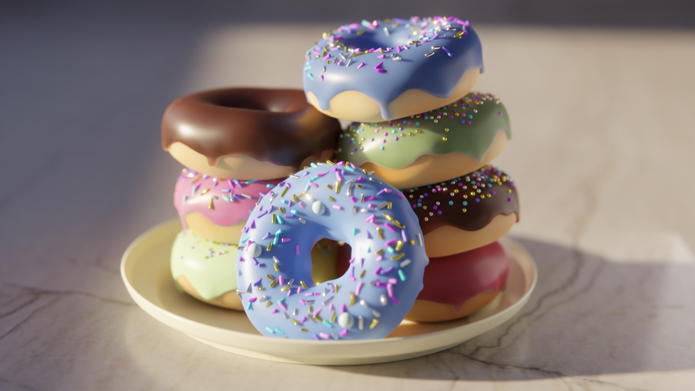

# Donut-3D-Model

Bunch of 3D modeled donuts stacked on each other. Created the complete scene and the animation rendering. This was my first Blender work and shout out to the legendary @Blender Guru on YouTube for the tutorial. 

## Preview

## About

This repository has the Blender file, the textures, and rendered images and animation. Feel free to download and tweak :)

## License

It was a hobby project, feel free to steal.

## Notes 

Made this in 2023 (3 years ago), I cannot remember to give instruction on what I used or how I used it. 

Credits: I followed the @Blender Guru tutorial on youtube. 
